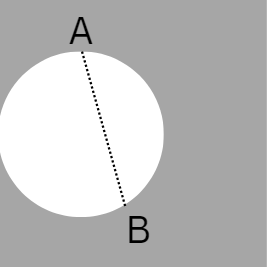
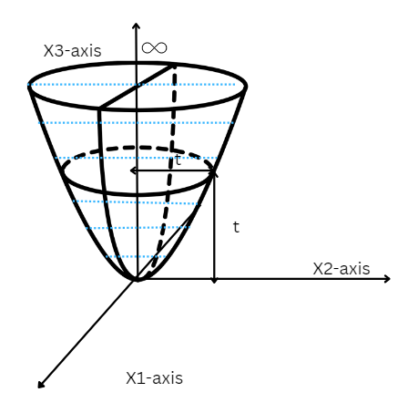

# Convex Optimization Assignment 2 Solutions

## General Instructions

The following document contains the solutions to the questions for Assignment 2. Please note that the solutions provided may not be the only possible way to solve the questions. They indicate only one of the many (possibly) valid solutions. The solutions provided are relatively crisp and do not include all the steps that you must have. Your solution should be logical and contain all supporting arguments. Feel free to contact any of the TAs via email in case of any discrepancy you find in the solutions provided.

## Question 1
No. Consider two points that lie on the surface of the $m$-dimensional sphere. The line joining these two points passes through the sphere. And so the points on this line that lie inside the sphere do not belong to the system. Here, our system only consists of all points that lie inside the hypercube but not the sphere. Thus, it does not satisfy the definition of a convex set.  

Example: Consider the case when the dimension of the hypercube is $2$ and the dimension of the sphere is $2$.    

The region in grey represents our system.
Points $A$ and $B$ belong to the system. But the points on the line segment $AB$ do not. Thus, it does not satisfy the definition of a convex set.

## Question 2

Let us consider a half space $H$ which is defined as
${H : \{x | a^T x \le b\}}$
where ${x, a \in \mathbb{R}^n}$, $b$ is a constant.

$a)$ Take two points $x_1$ and $x_2$ in $H$, for $H$ to be convex, the line segment joining the two points should also be in $H$. 
That is, for any ${\lambda \in [0, 1]}$, the point ${\lambda x_1 + (1-\lambda)x_2}$ is in $H$.

As $x_1$ and $x_2$ are in $H$, they will satisfy ${a^T x_1 \le b}$ and ${a^T x_2 \le b}$. Now, calculating the value for ${a^T(\lambda x_1 + (1-\lambda)x_2)}$

$$
\begin{align*}
a^T(\lambda x_1 + (1-\lambda)x_2) &= \lambda a^T x_1 + (1-\lambda)a^T x_2 \\
&\leq \lambda b + (1-\lambda)b \\
&= b
\end{align*}
$$

Since ${\lambda x_1 + (1-\lambda)x_2}$ satisfies ${a^T x \leq b}$, the line segment between ${x_1}$ and ${x_2}$ is also in ${H}$. Therefore, ${H}$ is a convex set.

$b)$ It is given that $H$ is a closed set, we need to check whether $H$ is compact or not. We know that a closed and bounded set in any Euclidean set ${\mathbb{R}^n}$, will be compact. Even though $H$ is closed its not bounded because a half space is unbounded. Therefore, $H$ is not compact.

## Question 3

Let $A$ be the affine set in $\mathbb{R^n}$ that contains $\mathbf{0}$. Any point in an affine set can be represneted using 2 other points in the set as follows:

$$
\begin{align*}
\mathbf{x} &= \alpha \mathbf{x_1} + (1-\alpha)\mathbf{x_2}
\end{align*}
$$

If $\mathbf{x_1} \in A$ and $\mathbf{x_2} \in A$, then by definition of an affine set, 

$$
\alpha \mathbf{x_1} + (1-\alpha)\mathbf{x_2} \in A  \ \ \forall \alpha \in \mathbb{R}
$$

To prove that a given space is a subspace of a vector space, it is sufficient to prove that linear combinations of elements in the subspace lie in the same subspace.  Thus, for any $\mathbf{x_1}, \mathbf{x_2} \in {A},$ and $c_1, c_2 \in \mathbb{R}$, we must have:

$$
\begin{align*}
(c_1\mathbf{x_1} + c_2\mathbf{x_2}) \in {A}   
\end{align*}
$$

Thus, set $c_1 = \alpha$ and $c_2 = 1- \alpha$ 
This ensures that every linear combination of points belongs in $A$. \
The element $\mathbf{0}$ is important since we want $A$ to be closed under scalar multiplication and addition. Using the $\mathbf{0}$ element, for scalar multiplication, we can write:

$$
\alpha \mathbf{x} = (1-\alpha)\mathbf{0} + \alpha \mathbf{x}
$$

For addition, we can set $\alpha=\frac{1}{2}$ and write:

$$
\begin{align*}
\frac{1}{2} \left(\mathbf{x_1} + \mathbf{x_2}\right) &= \frac{1}{2} \mathbf{x_1} + \frac{1}{2}\mathbf{x_2}
\end{align*}
$$

Thus $A$ is a subspace. \
To demonstrate this idea: consider a line in $\mathbb{R^n}$ (which is an affine set) that doesn't pass through origin. What is the additive identity for the subspace? It doesn't exist. Hence, the set cannot be a subspace.

## Question 4

$a)$ The subspace spanned by the given vectors is 2-dimensional since the two vectors are linearly independent. Thus, in $\mathbb{R}^3$ the perpendicular space to our subspace has dimension $3-2 = 1$.

Let $\mathbf{v_1} = [v_1\ v_2\ v_3]^T$ be the vector that generates the perpendicular space. Then the following must hold true 

$$ 
\begin{align*}
\begin{bmatrix} 1 & 0 & 3 \end{bmatrix}\mathbf{v_1}=0\\   
\begin{bmatrix} 3 & 9 & 0 \end{bmatrix}\mathbf{v_1}=0
\end{align*}
$$

One choice for $\mathbf{v_1}$ is clearly 
$\mathbf{v_1} = [3\ -1\ -1]^T$. Thus, the subspace in the form $A \mathbf{x} = \mathbf{0}$ is given by $[3\ -1\ -1]\mathbf{x}=0$ where $\mathbf{x} \in \mathbb{R}^3$.

$b)$ The subspace spanned by the given vectors in this case is $1$-dimensional since the two vectors are not linearly independent.  Thus, in $\mathbb{R}^3$ the perpendicular space to our subspace has dimension $3-1 = 2$. Let $\mathbf{v_1}, \mathbf{v_2}$ be two linearly independent vectors that generate the perpendicular space. Then the following must hold true 

$$ 
\begin{align*}
\begin{bmatrix} 1 & 0 & -1 \end{bmatrix}\mathbf{v_1}=0\\   
\begin{bmatrix} 1 & 0 & -1 \end{bmatrix}\mathbf{v_2}=0\\
\end{align*} 
$$ 

Also,

$$ 
\begin{align*}
\mathbf{v_2} \neq \alpha\mathbf{v_1} \quad \text{for any } \alpha\in \mathbb{R}
\end{align*} 
$$

One choice for $\mathbf{v_1}$ and $\mathbf{v_2}$ that satisfy the above three conditions is clearly $\mathbf{v_1} = [1\ \ 0\ \ 1]^T$ and $\mathbf{v_1} = [0\ \  1\ \ 0]^T$  

Thus, when 

$$
A  = \begin{bmatrix}
    1 & 0 & 1 \\
    0 & 1 & 0 \\
\end{bmatrix}
$$

and $A \mathbf{x} = \mathbf{0}$ denotes the given subspace

Note: In the above question, matrix $A$ has multiple valid choices in both part $(a)$ and part $(b)$. The above solution is just one such valid choice of matrix $A$.

Let $\mathbf{x_1}, \mathbf{x_2} \in X$ and $0< \alpha < 1 $  

$$ 
\begin{align*}
\mathbf{v} &:= \alpha\mathbf{x_1}+(1-\alpha)\mathbf{x_2}\\
A\mathbf{v} &= A(\alpha\mathbf{x_1}+(1-\alpha)\mathbf{x_2})\\
\end{align*}
$$

$$
\begin{align*}
\implies A\mathbf{v} + \mathbf{b} &= A(\alpha\mathbf{x_1}+(1-\alpha)\mathbf{x_2}) +\mathbf{b}\\
&=\alpha(A\mathbf{x_1}+b)+(1-\alpha)(A\mathbf{x_2} +\mathbf{b})\\
&=\alpha(\mathbf{u_1})+(1-\alpha)(\mathbf{u_2}) \text{ for some } \mathbf{u_1}, \mathbf{u_2} \in U 
\end{align*} 
$$

Since $U$ is convex,

$$ 
\begin{align*}
\alpha\mathbf{u_1}+(1-\alpha)(\mathbf{u_2}) &\in U\\
A\mathbf{v} + \mathbf{b} &\in U\\ 
\implies \mathbf{v} = a\mathbf{x_1}+(1-a)\mathbf{x_2} &\in U
\end{align*} 
$$

Thus, $X$ is a convex set

## Question 5
We have ${\mathbb{X} = {\mathbf{x} : ||\mathbf{x} - \mathbf{x_0}}||_2 \le r}$, where ${\mathbf{x}, \mathbf{x_0} \in \mathbb{R}^2}$. 

We need to show that $\mathbb{X}$ is convex. To show that the set $\mathbb{X}$ is convex, we need to demonstrate that for any two points $\mathbf{a}$ and ${\mathbf{b}}$ in ${\mathbb{X}}$, the line segment connecting ${\mathbf{a}}$ and ${\mathbf{b}}$ lies entirely within ${\mathbb{X}}$.

Let ${\mathbf{a} = (a_1, a_2)}$ and ${\mathbf{b} = (b_1, b_2)}$ be two points in ${\mathbb{X}}$, meaning 

$$
{\|\mathbf{a} - \mathbf{x}_0\|_2 \leq r}\\
{\|\mathbf{b} - \mathbf{x}_0\|_2 \leq r}
$$

Now, consider a point ${\mathbf{y}}$ on the line segment connecting ${\mathbf{a}}$ and ${\mathbf{b}}$, given by ${\mathbf{y} = \lambda \mathbf{a} + (1-\lambda) \mathbf{b}}$ for ${\lambda}$ in the range $[0, 1]$.

The Euclidean norm of ${\mathbf{y} - \mathbf{x}_0}$ is:

$$
{\|\mathbf{y} - \mathbf{x}_0\|_2 = \|\lambda (\mathbf{a} - \mathbf{x}_0) + (1-\lambda)(\mathbf{b} - \mathbf{x}_0)\|_2 }
$$

Using the triangle inequality property of the Euclidean norm:

$$
{ \|\mathbf{y} - \mathbf{x}_0\|_2 \leq \lambda \|\mathbf{a} - \mathbf{x}_0\|_2 + (1-\lambda) \|\mathbf{b} - \mathbf{x}_0\|_2 }
$$

Since ${\|\mathbf{a} - \mathbf{x}_0\|_2}$ and ${\|\mathbf{b} - \mathbf{x}_0\|_2}$ are both less than or equal to ${r}$ (as ${\mathbf{a}}$ and ${\mathbf{b}}$ are in ${\mathbb{X}}$), we have:

$$
{ \|\mathbf{y} - \mathbf{x}_0\|_2 \leq \lambda r + (1-\lambda) r = r }
$$

This shows that ${\mathbf{y}}$ is also in ${\mathbb{X}}$, and therefore, the set ${\mathbb{X}}$ is convex.

The set ${\mathbb{X}}$ is a closed circle centered at ${\mathbf{x}_0}$ with radius ${r}$ in ${\mathbb{R}^2}$. The region corresponding to ${\mathbb{X}}$ for any choice of ${r}$ is the cirlce with center ${\mathbf{x}_0}$ and radius ${r}$.

## Question 6
$a)$ Let the diagonal entries of $\mathbf{D}$ be $d_1$ and $d_2$.

$$
\begin{align*}
\mathbf{(x-x_0)^TD(x-x_0)} &= \sum_{k=1}^{2} (x_k-x_0)d_k(x_k-x_0) \\
&= (x_1-x_0)^2d_1+(x_2-x_0)^2d_2
\end{align*}
$$

$$
\begin{align*}
\mathbb{X}=\{x_1, x_2 : (x_1-x_0)^2d_1+(x_2-x_0)^2d_2 \leq r \}  \\
\implies \mathbb{X}=\{x_1, x_2 : \frac{(x_1-x_0)^2}{r/d_1}+\frac{(x_2-x_0)^2}{r/d_2} \leq 1 \}  \\
\end{align*}
$$

This is the region inside an ellipse with centre $(x_0, x_0)$ and major and minor axes either $r/d_1$ and $r/d_2$ or vice versa. For the special case of $d_1=d_2$, it is a circular region. If exactly one of $d_1$ or $d_2$ is $0$, then it is the region between two points along a line segment. If both are $0$, then the set is non empty for all non-negative values of $r$. Though it hasn't been explicitly mentioned, r is taken to be non-negative here.

$b)$ For every possible case, $\mathbb{X}$ constitutes a convex set. (An ellipse in 2D is a convex set, and so are all special cases for modifications of ellipses).
 

## Question 7
Let $\mathbf{v_1} = \left(\mathbf{x_1},t_1\right) \in X$ and $\mathbf{v_2} = \left(\mathbf{x_2},t_2\right) \in X$  

Thus,  

$$\lVert \mathbf{x_1}\rVert_2\leq t_1\quad t_1\geq 0\\  
\lVert \mathbf{x_2}\rVert_2\leq t_2\quad t_2\geq 0
$$  

Let $0< \alpha <1$

$$ 
\begin{align*}
\mathbf{v}:&=\alpha\mathbf{v_1}+(1-\alpha)\mathbf{v_2}\\
& = (\alpha\mathbf{x_1}+(1-a)\mathbf{x_2}, \alpha t_1+(1-\alpha)t_2)\\
&= (\mathbf{x},t) 
\end{align*} 
$$

Clearly, $t= at_1+(1-a)t_2 >0$  

$$ 
\begin{align*}
\lVert \mathbf{x}\rVert_2 &= \lVert \alpha\mathbf{x_1}+(1-\alpha)\mathbf{x_2}\rVert_2\\
&\le  \alpha\lVert\mathbf{x_1}\rVert_2+(1-\alpha)\lVert\mathbf{x_2}\rVert_2 \\
&\le \alpha t_1+(1-\alpha)t_2 = t 
\end{align*} 
$$

Thus, $\mathbf{v} =  (\mathbf{x},t) \in X $. Hence, $X$ is convex set.

Below is an image of the region corresponding to $X$:

