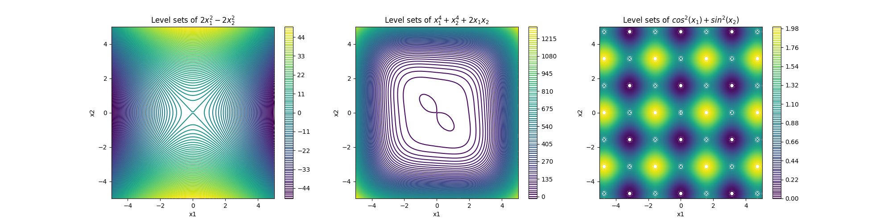

# Convex Optimization Assignment 4 Solutions

## General Instructions

The following document contains the solutions to the questions for Assignment 4. Please note that the solutions provided may not be the only possible way to solve the questions. They indicate only one of the many (possibly) valid solutions. The solutions provided are relatively crisp and do not include all the steps that you must have. Your solution should be logical and contain all supporting arguments. Feel free to contact any of the TAs via email in case of any discrepancy you find in the solutions provided.

## Question 1

$$
\begin{align*}
f(\mathbf{x}) = \frac{c}{\lVert \mathbf{x} \rVert}, \ \ \ \   \lVert \mathbf{x} \rVert \neq 0
\end{align*}
$$

where $\mathbf{x} \in \mathbb{R}^n$ and $c$ is a real constant. $\lVert \mathbf{x} \rVert = \sqrt{x_1^2+x_2^2+ \cdots x_n^2}$

The gradient of any function $f(\mathbf{x})$ is given by:

$$
\begin{align*}
\nabla f(\mathbf{x}) = \begin{bmatrix}
\frac{\partial f(\mathbf{x})}{\partial x_1} \\\
\frac{\partial f(\mathbf{x})}{\partial x_2} \\\
\vdots \\\
\frac{\partial f(\mathbf{x})}{\partial x_n} \\\
\end{bmatrix}
\end{align*}
$$

Thus, the gradient is:

$$
\begin{align*}
\nabla f(\mathbf{x}) = \begin{bmatrix}
\frac{-x_1c}{\lVert \mathbf{x} \rVert^3} \\\
\frac{-x_2c}{\lVert \mathbf{x} \rVert^3} \\\
\vdots \\\
-\frac{x_3c}{\lVert \mathbf{x} \rVert^3} \\\
\end{bmatrix} = \frac{-c}{\lVert \mathbf{x} \rVert^3} \begin{bmatrix}
x_1 \\\
x_2 \\\
\vdots \\\
x_n \\\
\end{bmatrix} = -\frac{c\mathbf{x}}{\lVert \mathbf{x} \rVert^3}
\end{align*}
$$

The Hessian of any function $f(\mathbf{x})$ is given by:

$$
\begin{align*}
\nabla^2 f(\mathbf{x}) = \begin{bmatrix}
\frac{\partial^2 f(\mathbf{x})}{\partial x_1^2} & \frac{\partial^2 f(\mathbf{x})}{\partial x_1 \partial x_2} & \cdots & \frac{\partial^2 f(\mathbf{x})}{\partial x_1 \partial x_n} \\\
\frac{\partial^2 f(\mathbf{x})}{\partial x_2 \partial x_1} & \frac{\partial^2 f(\mathbf{x})}{\partial x_2^2} & \cdots & \frac{\partial^2 f(\mathbf{x})}{\partial x_2 \partial x_n} \\\
\vdots & \vdots & \ddots & \vdots \\\
\frac{\partial^2 f(\mathbf{x})}{\partial x_n \partial x_1} & \frac{\partial^2 f(\mathbf{x})}{\partial x_n \partial x_2} & \cdots & \frac{\partial^2 f(\mathbf{x})}{\partial x_n^2} 
\end{bmatrix}
\end{align*}
$$

Thus, the Hessian is:

$$
\begin{align*}
\nabla^2 f(\mathbf{x}) = \frac{c}{\lVert \mathbf{x} \rVert^3} \begin{bmatrix}
\frac{3x_1^2}{\lVert \mathbf{x} \rVert^2} - 1 & \frac{3x_1x_2}{\lVert \mathbf{x} \rVert^2} & \cdots & \frac{3x_1x_n}{\lVert \mathbf{x} \rVert^2} \\
\frac{3x_2x_1}{\lVert \mathbf{x} \rVert^2} & \frac{3x_2^2}{\lVert \mathbf{x} \rVert^2} - 1 & \cdots & \frac{3x_2x_n}{\lVert \mathbf{x} \rVert^2} \\
\vdots & \vdots & \ddots & \vdots \\
\frac{3x_nx_1}{\lVert \mathbf{x} \rVert^2} & \frac{3x_nx_2}{\lVert \mathbf{x} \rVert^2} & \cdots & \frac{3x_n^2}{\lVert \mathbf{x} \rVert^2} - 1 \\
\end{bmatrix}
\end{align*}
$$

## Question 2
Let $x \in \mathbb{R^n}$  

$$
\begin{align*}
\mathbf{g(\mathbf{x})} &= \frac{c}{\|\mathbf{x}\|^2} \mathbf{e_x} \quad \forall \mathbf{x} \neq 0  \\
&= \frac{c}{(x_1^2+...+x_n^2)^{3/2}} \mathbf{x}
\end{align*} 
$$

Let $\mathbf{g(\mathbf{x})} = ( g_1(\mathbf{x}),.., g_n(\mathbf{x}))^T$

Thus, we have  $g_i(\mathbf{x}) = \frac{c}{(x_1^2+...+x_n^2)^{3/2}} x_i$

$$
\begin{align*}
\frac{\partial g_i}{\partial x_j} &= \frac{-3cx_ix_j}{(x_1^2+...+x_n^2)^{5/2}} \\
&= \frac{-3c}{\|\mathbf{x}\|^5} x_ix_j, \quad \forall i \neq j
\end{align*} 
$$

When $j=i$ ,  

$$
\begin{align*}
\frac{\partial g_i}{\partial x_i} &= \frac{-3cx_i^2}{(x_1^2+...+x_n^2)^{5/2}} + \frac{c}{(x_1^2+...+x_n^2)^{3/2}}\\
&= \frac{-3c}{\|\mathbf{x}\|^5} x_i^2 + \frac{c}{\|\mathbf{x}\|^3}
\end{align*} 
$$

If $A =\mathbf{x}\mathbf{x}^T =\{a_{ij}\},$  then $a_{ij} = x_ix_j$

Thus, derivative matrix   

$$
D(\mathbf{g(\mathbf{x})})=\frac{-3c}{\|\mathbf{x}\|^5}\mathbf{x}\mathbf{x}^T + \frac{c}{\|\mathbf{x}\|^3}I
$$

where $I$ is the nxn Identity Matrix

## Question 3
Calculating the Gradient of $\lVert Ax - b \rVert^2$

We have ${ \lVert\mathbf{A}\mathbf{x} - \mathbf{b}\rVert ^2 }$, let's expand this expression. 

$$
\begin{align*}
\lVert\mathbf{A}\mathbf{x} - \mathbf{b}\rVert ^2 &= (\mathbf{A}\mathbf{x} - \mathbf{b})^T (\mathbf{A}\mathbf{x} - \mathbf{b})\\ 
&= (\mathbf{x}^T A^T -\mathbf{b}^T)(\mathbf{A}\mathbf{x} - \mathbf{b}) \\
&= \mathbf{x}^T \mathbf{A}^T \mathbf{A}\mathbf{x} - \mathbf{x}^T \mathbf{A}^T\mathbf{b} -\mathbf{b}^T \mathbf{A}\mathbf{x} +\mathbf{b}^T\mathbf{b}\\
&= \mathbf{x}^T\mathbf{A}^T\mathbf{A}\mathbf{x} - 2\mathbf{x}^T\mathbf{A}^T\mathbf{b} +\mathbf{b}^T\mathbf{b} 
\end{align*}
$$

Differentiating ${ \lVert\mathbf{A}\mathbf{x} - \mathbf{b}\rVert^2 }$ with respect to ${ \mathbf{x} }$:

$$
{ \nabla_\mathbf{x} \lVert\mathbf{A}\mathbf{x} - \mathbf{b}\rVert^2 = 2\mathbf{A}^T \mathbf{A}\mathbf{x} - 2\mathbf{A}^T\mathbf{b} }
$$

This is the gradient of ${ \|\mathbf{A}\mathbf{x} - \mathbf{b}\|^2 }$ with respect to ${ \mathbf{x} }$.

To find the least squares solution for the equation ${ \mathbf{\mathbf{Ax}} =\mathbf{b} }$, we set the gradient of ${ \|\mathbf{Ax} -\mathbf{b}\|^2 }$ to zero:

$${ 2\mathbf{A}^T \mathbf{Ax} - 2\mathbf{A}^T\mathbf{b} = 0 }$$

$${ \mathbf{A}^T \mathbf{Ax} = \mathbf{A}^T\mathbf{b} }$$

Now, if ${ \mathbf{A}^T \mathbf{A} }$ is invertible, we can solve for ${ \mathbf{x} }$ as follows:

$$
{ \mathbf{x} = (\mathbf{A}^T \mathbf{A})^{-1} \mathbf{A}^T\mathbf{b} }
$$

This is the least squares solution for the equation ${ \mathbf{Ax} =\mathbf{b} }$. Note that it also satisfies the second order condition.

## Question 4
Computing the Hessian of 

$a)$ $f(x) = 2x_1^2 - 2x_2^2$ we get 

$$
\nabla ^2 f(x) = \begin{bmatrix} 4 & 0 \\\ 0 & -4 \end{bmatrix}
$$

$b)$ $f(x) = x_1^4 + x_2^4 + 2x_1x_2$ we get 

$$
\nabla ^2 f(x) = \begin{bmatrix} 12x_1^2 & 2 \\\ 2 & 12x_2^2 \end{bmatrix}
$$

$c)$ $f(x) = \cos^2(x_1) + \sin^2(x_2)$ we get

$$
\nabla ^2 f(x) = \begin{bmatrix} -2\cos(2x_1) & 0 \\\ 0 & 2\cos(2x_2) \end{bmatrix}
$$

Below is the image of the level sets of these functions 

